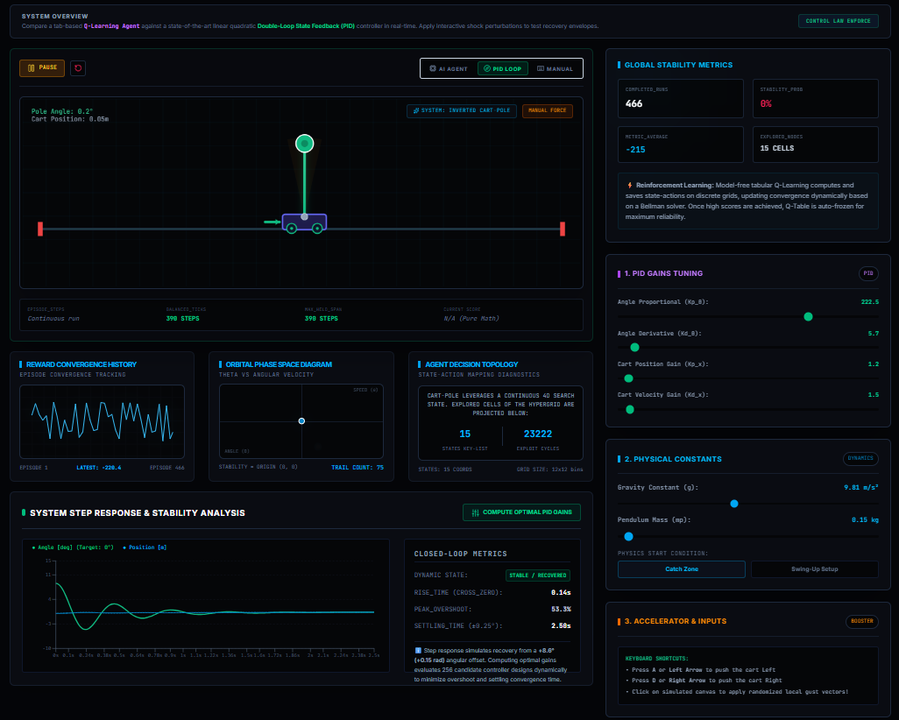
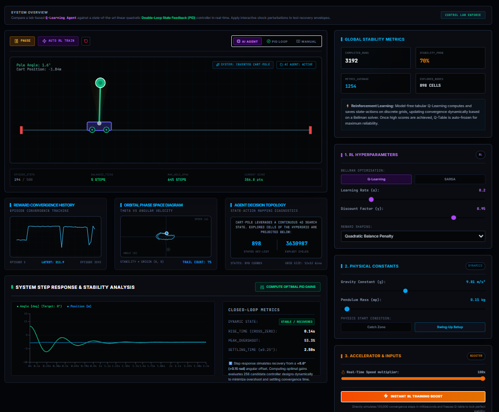

# Cart-Pole Stabilization System

A real-time interactive simulation environment for studying the stabilization and control of the nonlinear **Inverted Pendulum (Cart-Pole)** system. This project implements and compares two fundamentally different approaches: classical control theory and modern reinforcement learning.

---

## 📌 Project Overview

The inverted pendulum is a classic benchmark problem in control engineering and reinforcement learning. This platform lets users switch between control modes in real time to observe how each controller handles disturbances, state changes, and nonlinear dynamics. It serves as both an educational tool and an experimental sandbox for control system analysis.

---

## 📷 System Demonstration

### Classical PID Controller
The PID controller stabilizes the pendulum using deterministic feedback derived directly from the system states (position, velocity, angle, and angular velocity). 



### Reinforcement Learning Controller
The RL agent learns a stabilization policy through environmental interaction and reward optimization, discovering an effective strategy entirely through exploration and experience.



---

## ✨ Key Features

* **Dual Control Modes:** Switch instantly between a Classical PID controller and a Reinforcement Learning agent (Q-Learning / SARSA).
* **High-Fidelity Physics:** Features nonlinear cart-pole dynamics, Euler/Runge-Kutta numerical integration, and realistic modeling of inertia, friction, and actuator limits.
* **Real-Time Visualization:** Live monitoring of system states, phase-space rendering, and force/error tracking.
* **On-the-Fly Configuration:** Tweak simulation parameters during runtime (e.g., pendulum/cart mass, friction, track limits, and max force).

---

## 📐 Classical PID Controller

The controller computes the applied force based on four state variables: cart position ($x$), cart velocity ($\dot{x}$), pendulum angle ($\theta$), and angular velocity ($\dot{\theta}$).

The control force $F$ applied to the cart is defined as:

$$F = K_{p,\theta}e_{\theta} + K_{d,\theta}\dot{e}_{\theta} + K_{i,\theta}\int e_{\theta}dt - K_{p,x}x - K_{d,x}\dot{x} - K_{i,x}\int xdt$$

Where $K_p$, $K_d$, and $K_i$ represent the proportional, derivative, and integral gains respectively. The angular terms maintain upright balance, while the positional terms keep the cart centered on the track.

### ⚠️ Physical Limitations: The 0° Equilibrium

Even perfectly tuned systems won't stay absolutely frozen at 0°. Small micro-oscillations occur naturally due to:
1.  **Time Discretization:** The simulation runs in finite time steps. Applying control actions after a slight delay introduces tiny overshoots.
2.  **Residual Momentum:** Corrective forces are still needed to dissipate kinetic energy as the pendulum approaches equilibrium.
3.  **Resolution Limits:** Finite control authority and friction prevent a completely motionless state, accurately reflecting real-world physical behavior.

---

## 🧠 Reinforcement Learning Framework

The AI engine uses a model-free, tabular reinforcement learning approach.

* **Q-Learning:** An off-policy method estimating optimal state-action values independently of the current behavior.
* **SARSA:** An on-policy method updating action values based directly on the policy being executed.

### 📈 Reward Shaping

To accelerate convergence and prevent the agent from wandering, we use a multi-tiered reward structure that encourages tight stabilization near the equilibrium point:

| Angular Error | Position Error | Stabilization Bonus | Objective |
| :--- | :--- | :--- | :--- |
| < 1.2° | < 4 cm | +45.0 | Precise equilibrium maintenance |
| < 2.5° | < 10 cm | +15.0 | Strong convergence toward center |
| < 5.0° | < 20 cm | +5.0 | Guidance toward stable behavior |

---

## 📊 Control Strategy Comparison

| Feature | PID Controller | Reinforcement Learning |
| :--- | :--- | :--- |
| **Control Type** | Model-Based | Model-Free |
| **Math Formulation** | Explicit | Learned |
| **Training Required** | No | Yes |
| **Computational Cost**| Low | Higher |
| **Adaptability** | Limited | High |
| **Interpretability** | High | Moderate |

---

## 🚀 Local Setup

**Prerequisites:** Ensure you have Node.js and npm installed.

```bash
# Clone the repository
git clone [https://github.com/your-username/cartpole-pid-rl.git](https://github.com/your-username/cartpole-pid-rl.git)
cd cartpole-pid-rl

# Install dependencies
npm install

# Run development server
npm run dev
